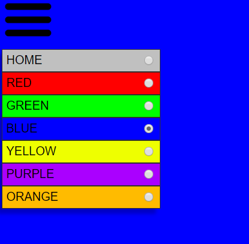

# Colortoggler

Aan deze minimale eisen moet jouw project voldoen:

1. Als gebruiker wil ik op een hamburger-icoon kunnen klikken dat uitklapt als ik er op klik. 
    - Gebruik een `ul` en `li` voor het menu.
    - Focus je vooral op de JavaScript (dus weinig tijd aan de CSS)

2. Als gebruiker wil ik in het uitgeklapte menu een keuze hebben aan kleuren (uitgeschreven in tekst). Elk item in het menu is één kleur.
3. Als gebruiker wil ik op één van de kleuren kunnen klikken. 
4. Wanneer ik als gebruiker op de kleur in het menu heb geklikt verandert de achtergrondkleur van de gehele pagina in de aangeklikte kleur.
5. Wanneer ik als gebruiker op de kleur in het menu klik, klapt het menu weer terug in.

# **Bonus Requirements  🚀**

- Als gebruiker wil ik niet alleen de kleurennamen lezen, ik wil ook de kleuren kunnen zien in het menu. Elke "rij" in het menu heeft toont een kleur.
- Als gebruiker wil ik op een radiobutton kunnen klikken van de kleur van mijn keuze, waardoor ik aan de radiobutton zie wat de huidige kleur is die "actief" is op dit moment.

- Als gebruiker wil ik in plaats van klikken met mijn muis over de hamburger kunnen hoveren, waardoor het menu verschijnt. Wanneer ik als gebruiker met mijn muist weer wegga bij de hamburger verdwijnt het menu weer.
- Als gebruiker wil ik de naast de veranderende achtergrondkleur ook de uitgeschreven naam van de achtergrondkleur op de achtergrond zien wanneer ik deze heb aangeklikt.
- Als gebruiker wil ik het menu langzaam in beeld zien schuiven en weer uit beeld zien schuiven, in plaats van plotseling verschijnen (doe dit met CSS transitions). (de richting maakt niet uit!)
- Verander de kleuren door het gebruik van keyboard toetsen (1 voor home, 2 voor rood, 3 voor oranje, etc.) ⇒ ****hier heb je dus een nieuw Event Type nodig...
